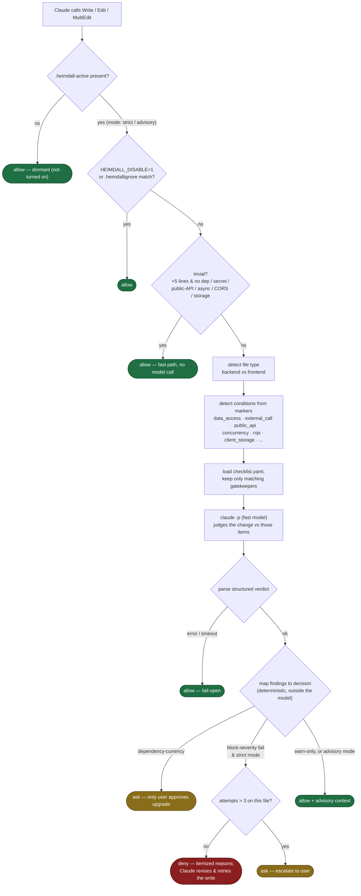

# Heimdall

A **command-gated** Claude Code plugin that intercepts every `Write`, `Edit`, and
`MultiEdit` **before it executes** (a `PreToolUse` hook) and forces a structured
self-challenge against an extensible, file-type-aware checklist. If the change fails a
blocking item in strict mode, the write is **denied** with an itemized reason and Claude
must revise — usually to something shorter and simpler — before the write is allowed.

It is a **hook**, not advice in a prompt: the harness enforces the decision, so the agent
can't "forget" or talk its way past it. It stays **dormant** until you run `/heimdall-on`,
so installing it costs nothing until you want it.

## Why a hook (and why this shape)

Only a `PreToolUse` hook can deterministically gate *every* write. But research into mature
quality gates (SonarQube, Danger, ci-review-gate, and the AI-code-review false-positive
literature — see [`RESEARCH_FINDINGS.md`](RESEARCH_FINDINGS.md)) is unanimous on three things:

1. **The block/allow decision must be deterministic and live outside the model.** The model
   supplies findings; a fixed rule maps findings → decision. Otherwise the gate isn't
   reproducible or tunable.
2. **False positives compound into wholesale bypass.** So: a triviality escape hatch, a
   strict/advisory switch, `block` vs `warn` severities, and per-rule suppression.
3. **A broken gate must never brick the edit loop.** So the hook **fails open** — any parse,
   spawn, or timeout error allows the write.

So the hook is a `type: "command"` Node orchestrator (`hooks/heimdall-gate.js`) that does
the deterministic scaffolding and calls a fast headless model (`claude -p`) *only* for the
judgment step. That's still real LLM judgment — it just can't decide block/allow by itself,
and it reads the checklist from an external file you can edit. (A native `type: "prompt"`
hook exists in Claude Code, but it can't read `checklist.yaml` at runtime or enforce the
escape hatches — see the findings doc for the full trade-off.)

## How it decides



Same flow in words:

```
Write / Edit / MultiEdit
  → dormant?    (no .claude/.heimdall-active)      → allow
  → disabled?   (HEIMDALL_DISABLE=1 / .heimdallignore) → allow
  → trivial?    (<5 changed lines, no new dep / secret / public-API surface) → allow (fast, no model call)
  → else: detect backend vs frontend + marker conditions
          load checklist.yaml, keep matching entries
          claude -p (fast model) returns structured findings
          FIXED mapping:
             dependency-currency finding   → ask   (only you approve upgrades)
             block-severity fail (strict)  → deny  (itemized; capped at 3 retries → ask)
             warn-only, or advisory mode   → allow + advisory context
  → any error anywhere                                → allow (fail-open)
```

A denied write comes back like:

```
CHALLENGE RESULT (strict, backend): revise  (attempt 1/3)
FAILED (block): minimalism, thread-safety
  1. minimalism (Minimalism): Collapse the 3 nested loops into a single LINQ GroupBy — ~20 lines become ~4.
  2. thread-safety (Thread safety & load): _cache is a plain Dictionary mutated from concurrent handlers; use ConcurrentDictionary.
Revise the code to resolve the blocking items — prefer fewer, simpler lines — then retry the write.
```

## Competitive positioning: where Heimdall stands out

Based on the tools and approaches surveyed so far, no existing solution matches Heimdall's
full 7-point capability combination. The most important gaps across the current landscape:

- **No surveyed tool combines a true pre-write gate with real LLM-based judgment.** Tools
  that gate before code is written are deterministic only, while tools that use an LLM to
  judge quality/safety typically operate after the turn, after the commit, or at PR time.
- **Context-aware routing is effectively absent from the surveyed tools.** Heimdall's
  ability to detect backend vs frontend context and selectively apply rules based on code
  markers (data access, external calls, concurrency, RxJS, storage, etc.) did not appear in
  any comparable tool reviewed — arguably its strongest differentiator.

Taken together, the combination of (1) pre-write enforcement, (2) LLM-based judgment, and
(3) context-aware rule routing forms the core of what makes Heimdall distinct. Across the
surveyed tools, no alternative reproduces this combination.

| Tool | 1 · Pre-write gate | 2 · LLM judge | 3 · Editable checklist | 4 · Context routing | 5 · Strict/advisory | 6 · Dep ask | 7 · Fail-open + trivial | Score |
| --- | --- | --- | --- | --- | --- | --- | --- | --- |
| Anthropic security guidance | ✗ post-turn Stop hook; regex prewrite | ✓ | ✓ (Markdown) | ✗ | ✗ | ✗ | ~fail-open | ~2–3 |
| GouvernAI | ✓ (fails closed) | ✗ LLM only in advisory skill | ✓ (Markdown policies) | ✗ routes by action/risk-tier | ~partial | ✗ | ✗ | ~2 |
| rulebricks / claude-code-guardrails | ✓ | ✗ decision tables | ✓ (tables) | ✗ tool-name match | ✗ | ~generic ask | ✗ | ~2 |
| ai-pre-commit-reviewer | ✗ commit-time | ✓ | ✓ | ✗ 3 global booleans | ✗ | ✗ | ✗ | ~2 |
| GateGuard | ✓ | ✗ rejects LLM-judge | ✗ | ✗ | ✗ | ✗ | ✗ | ~1 |
| CodeRabbit | ✗ PR / post-hoc | ✓ | ~partial | ✗ | ✗ | ✗ | n/a | ~1 |
| paulmduvall quality gate | ✗ PostToolUse | ✗ linters/thresholds | ~partial | ✗ | ✗ | ✗ | ✗ | ~1 |
| Cursor afterFileEdit / Continue rules | ✗ notify-only/advisory | ✗ | — | ✗ | ✗ | ✗ | ✗ | ~0–1 |

The closest structural comparison is Anthropic's own security-guidance pattern, because it
does include LLM-based judgment, externally editable rules, and a multi-outcome review
flow. However, it still falls short of Heimdall in several critical areas:

- The LLM review happens after the turn, not as a true pre-write enforcement gate.
- It does not provide context-aware routing.
- It does not support a strong strict blocking mode.
- It does not include a dependency-approval escalation path.

In other words, even the nearest analogue does not reproduce Heimdall's core operating
model.

## Install

This is a self-contained plugin folder. Install it however you distribute Claude Code
plugins:

- **As a local plugin:** point a marketplace at the folder (or its parent), then
  `/plugin install heimdall@<your-marketplace>` from an interactive Claude Code session.
- **Manually:** copy this `heimdall/` folder into your plugins location so Claude Code loads
  `hooks/hooks.json` at session start.

Requirements: Node 16+ and the `claude` CLI on `PATH` (used for the judgment call). Zero
runtime npm dependencies.

## Use

```
/heimdall-on            # activate, strict mode (blocks on failure)
/heimdall-on advisory   # activate, advisory mode (warns, never blocks)
/heimdall-status        # is it on? which mode? which model?
/heimdall-off           # dormant again (hook stays installed)
```

Activation writes `.claude/.heimdall-active` (its contents are the mode) at the project
root — so the gate is **per-project**, even when the plugin is installed globally.

**No permission prompt.** The toggle runs through `scripts/toggle.js`, and each command
pre-authorizes it via `allowed-tools: Bash(node:*)` in its frontmatter — so `/heimdall-on`
just activates and prints its confirmation, with no "allow this command?" popup. (If your
Claude Code is configured to prompt regardless, add `"Bash(node:*)"` to the `allow` list in
`.claude/settings.json`.)

## Tuning

| Env var | Default | Effect |
| --- | --- | --- |
| `HEIMDALL_MODEL` | `haiku` | Model for the judgment call. A faster model = less latency/cost per non-trivial edit. |
| `HEIMDALL_TIMEOUT` | `90` | Seconds before the judge call is abandoned (→ fail-open allow). |
| `HEIMDALL_DISABLE` | unset | `1` fully disables the gate for the session (also set automatically inside the judge subprocess to prevent recursion). |

Per-path opt-out: add globs to a `.heimdallignore` file at the project root (one pattern
per line, `*`/`?` wildcards; matched against the target path).

## Add or change a heimdall

Edit [`hooks/checklist.yaml`](hooks/checklist.yaml) — nothing else. Each entry:

```yaml
  - id: my-new-check
    title: Short label
    question: "The single-line challenge the judge evaluates."
    applies_when: always        # always | backend_change | frontend_change | new_dependency |
                                # concurrency | cache | public_api | cloud_deploy | data_access |
                                # external_call | blocking_async | di_registration | cors_config |
                                # client_storage | rxjs
    severity: block             # block (denies in strict) | warn (advisory only) | ask (escalates to user)
    category: security          # informational grouping
    # enabled: false            # suppress without deleting
```

The orchestrator reads this file at runtime, keeps only entries whose `applies_when` matches
the current change (file type + content markers), and hands them to the judge. No code or
hook wiring changes are needed to add, remove, reweight, or disable a heimdall.

`applies_when` matching:

- `always` — every non-trivial change.
- `frontend_change` / `backend_change` — by file extension (`.tsx/.vue/.scss/...` → frontend;
  `.cs/.py/.go/...` → backend; ambiguous `.ts/.js` → frontend only inside a
  `components/`/`pages/`/`views/` path).
- `new_dependency` / `concurrency` / `cache` / `public_api` / `cloud_deploy` — matched by
  content markers and manifest/path heuristics (see `scripts/lib.js`).
- `data_access` (EF/ORM/SQL) · `external_call` (outbound HttpClient/REST) · `blocking_async`
  (`.Result`/`.Wait()`) · `di_registration` (DI container) · `cors_config` (CORS) · `client_storage`
  (localStorage/sessionStorage/cookie, frontend) · `rxjs` (Angular/RxJS, frontend) — all
  marker-gated so the check fires only when that construct is actually in the change.

## What ships

```
heimdall/
  .claude-plugin/plugin.json     # manifest
  skills/
    heimdall-on.md             # /heimdall-on [strict|advisory]  (allowed-tools: Bash(node:*), no prompt)
    heimdall-off.md            # /heimdall-off
    heimdall-status.md         # /heimdall-status
  hooks/
    hooks.json                   # PreToolUse registration (Write|Edit|MultiEdit)
    heimdall-gate.js           # the orchestrator (deterministic gate + model judgment)
    challenge-prompt.md          # prompt template (interpolates checklist.yaml at runtime)
    checklist.yaml               # THE list — edit this to add/remove gatekeepers
  scripts/
    lib.js                       # pure helpers: state, file-type, markers, triviality, YAML parse
    toggle.js                    # on/off/status writer the commands call (no-prompt activation)
    check-active.sh              # POSIX activation probe (convenience; gate.js self-gates)
  RESEARCH_FINDINGS.md           # Phase 0 survey + the hook-mechanism decision
  README.md
  CHANGELOG.md
```

## Known trade-offs

- **Latency/cost on non-trivial edits.** Each non-trivial write triggers one `claude -p`
  call. Mitigated by the triviality fast-path (most bulk edits skip it), the fast default
  model, and advisory mode. For very large mechanical migrations, run `advisory` or
  `/heimdall-off` during the bulk phase and re-enable for the review pass.
- **Marker heuristics are approximate.** `concurrency`/`cache`/`public_api` detection is
  regex-based; it errs toward *including* a checklist item rather than missing it. Tune the
  markers in `scripts/lib.js` if your stack uses different idioms.
- **Trivial fast-path is a real allow, not a mini-challenge.** By design — the research is
  clear that gating trivial edits is where gates lose their welcome. The necessity/minimalism
  reminder is attached as context instead.
